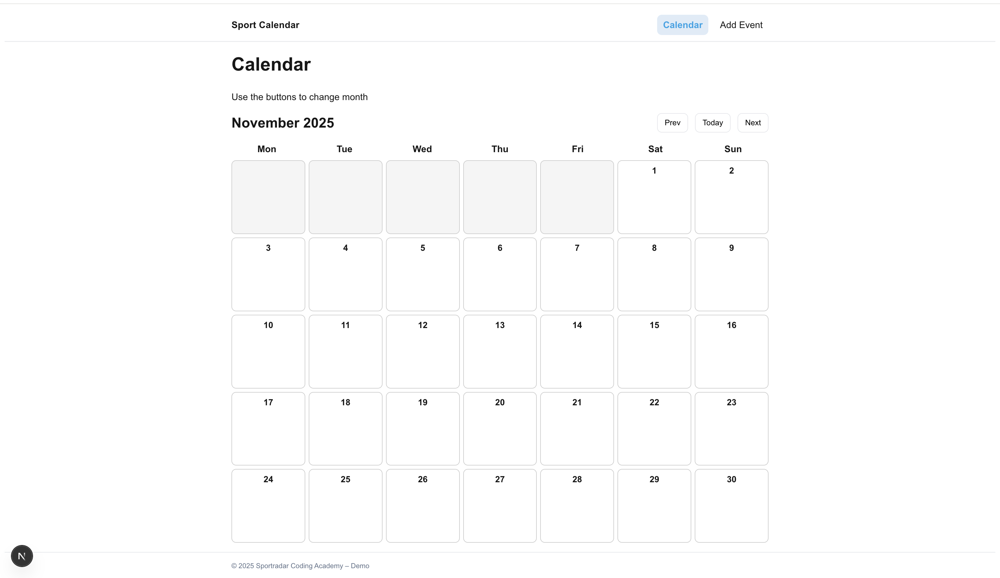
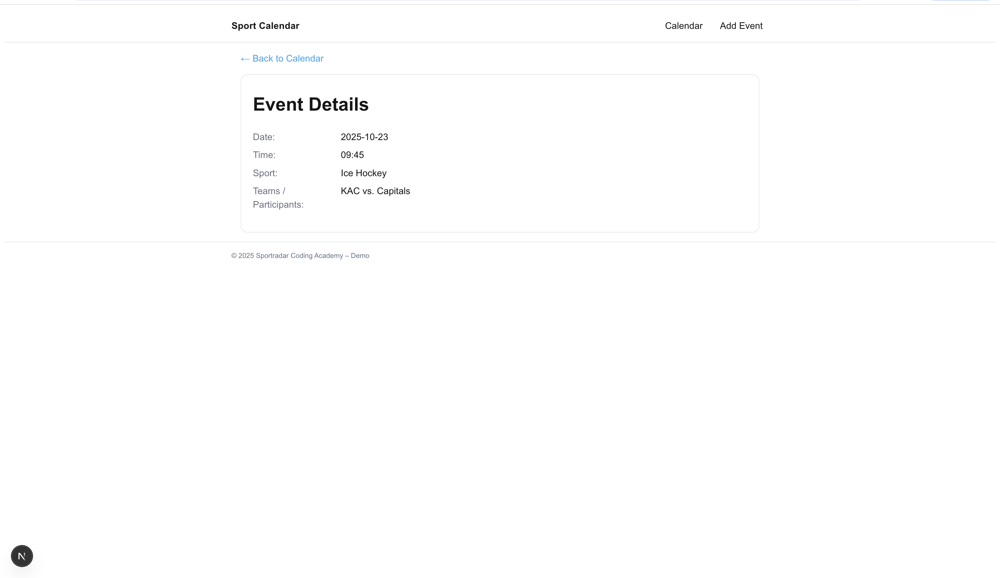

# Sports Event Calender

This project was created as part of the 2026 Sportradar Coding Academy application process.
The goal is to build a simple, interactive sports event calendar that allows users to view scheduled events, see event details, and add new events during runtime.

## Screenshots

### Calendar View



### Event Details



## Tech Stack

- Next.js App Router
- React Client Components and Hooks
- SCSS for styling
- Java Script data structure

## Getting Started

First, run the development server:

```bash
pnpm install
pnpm dev

```

Open [http://localhost:3000](http://localhost:3000) with your browser to see the result.

You can start editing the page by modifying `app/page.js`. The page auto-updates as you edit the file.

This project uses [`next/font`](https://nextjs.org/docs/app/building-your-application/optimizing/fonts) to automatically optimize and load [Geist](https://vercel.com/font), a new font family for Vercel.

## File Structure

app/
page.js → Calendar overview
add/page.js → Add Event form
event/[date]/[i]/page.js → Event Details page

components/
Calendar.js → Month grid renderer

lib/
calendar.js → Calendar matrix helpers
events.js → Event list + addEvent()

## What i learned

- How to generate a calendar grid dynamically using data logic
- How to map structured data events to UI elements and highlight active days
- How to handle client side navogation and dynamic routes in next.js
- How to use React state to manage form inputs and runtime added data
- how to apply responsive UI principles for multiple screen sizes
